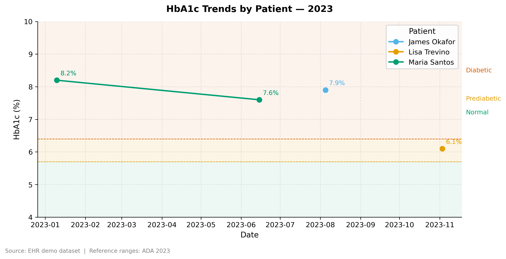

# Clinical EHR Data Analysis

Exploratory analysis of a synthetic electronic health record (EHR) 
dataset using SQL and Python with clinical domain knowledge.

Built as part of a portfolio targeting healthcare and biotech 
data analyst roles.

---

## Key findings

- Identified a diabetic patient cohort using ICD-10 code pattern 
  matching (E11.x) combined with HbA1c lab thresholds
- 3 of 4 diabetic patients had HbA1c above the 6.4% clinical 
  threshold across 2023 encounters
- Dr. Patel's patient panel showed the highest mean HbA1c (7.3%), 
  suggesting a higher-acuity caseload
- Patients with both diabetes and hypertension identified as 
  higher-risk using multi-condition CTE queries



---

## Dataset

Fully synthetic EHR database built in SQLite with 5 tables modeled 
after real-world EHR architecture (similar to OMOP CDM).  
No real patient information is included.

| Table | Description |
|---|---|
| `patients` | Demographics — name, DOB, sex, zip code |
| `encounters` | Visit records linked to patients |
| `diagnoses` | ICD-10 coded diagnoses per encounter |
| `medications` | Prescriptions per encounter |
| `lab_results` | LOINC-coded lab values per encounter |

To recreate the database locally, run `build_database.py` first, 
then open either notebook.

---

## Notebooks

| Notebook | Contents |
|---|---|
| `01_sql_analysis.ipynb` | Schema design, SQLite build, cohort queries, window functions, CTEs |
| `02_visualization.ipynb` | Matplotlib, Seaborn, Plotly, publication-quality styling, export |

---

## Skills demonstrated

- **SQL** — multi-table joins, CTEs, window functions, HAVING, 
  cohort selection with ICD-10 and LOINC codes
- **Python** — pandas, matplotlib, seaborn, plotly, scikit-learn
- **Clinical domain** — ICD-10, LOINC, HbA1c reference ranges, 
  EHR data architecture, colorblind-safe visualization
- **Git** — version control, repo structure, reproducible workflows

---

## Setup

```bash
git clone https://github.com/mdicomes/healthcare-eda-sql
cd healthcare-eda-sql
pip install -r requirements.txt
python build_database.py
jupyter notebook
```

Then open `notebooks/01_sql_analysis.ipynb` and run all cells.

---

*Reference ranges: ADA 2023 Standards of Care*  
*Data: fully synthetic — no real patient information*